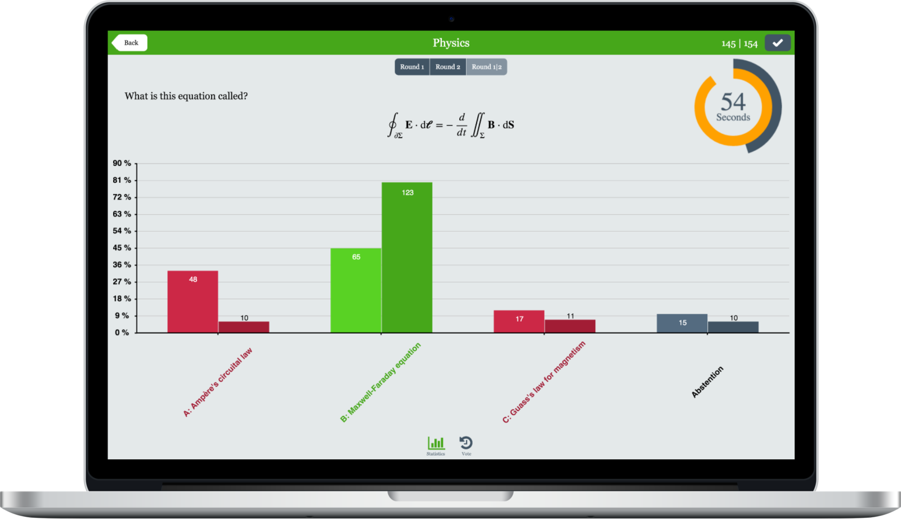

# ARSnova

ARSnova is a modern approach to Audience Response Systems (ARS). It is released under the GPLv3 license, and is offered as a Software as a Service free of charge. Head over to [arsnova.thm.de](https://arsnova.thm.de/) to see it in action.

ARSnova consists of two projects: the mobile client and the server. This repository contains the server code. You will find the client at thm-projects/arsnova-st2-js. However, you do not need to download both respositories in order to get started.

## Getting started

This is the main repository. Almost all dependencies (including the mobile client) are managed for you by Maven.  The mobile client is served via `index.html`, and optionally via `developer.html`. 

## Configuration

You will need to do some configuration work upfront.

 * Add a new directory "arsnova" in `/etc`, and create a copy of arsnova.properties.example named arsnova.properties in this directory.
 * Change settings to match your environment

### Server

In order to build up a full featured server installation containing ARSnova and CouchDB you have to install at least the following services:

 * Apache Tomcat 7.0.29 (or newer)
 * Apache Webserver 2.2 or newer with builtin modules `mod_proxy`, `mod_proxy_ajp` and `mod_proxy_http`
 * Apache CouchDB
 
Make sure all services are installed. Next step is to configure the Apache Webserver. Find the configuration file or create a new one for use with a virtual host. This depends on your needs. At least you should have a configuration containing these settings:

	<Location />
		ProxyPass ajp://127.0.0.1:8009/
		ProxyPassReverse ajp://127.0.0.1:8009/
	</Location>

All requests will be sent to your Apache Tomcat servlet container, using AJP running on port 8009.

To enable the required Apache Webserver modules simply type:

	# a2enmod proxy
	# a2enmod proxy_ajp
	# a2enmod proxy_http

The configuration is ready for development usage. Finally, you should (re)start all services. ARSnova is now listening on HTTP port 80.

### Database

We provide a script that will set up all database essentials. This "Setup Tool" is located at <https://scm.thm.de/arsnova/setuptool>. Make sure you have configured your database credentials inside the ARSnova configuration file: you will need to have the entries `couchdb.username` and `couchdb.password`.

## Credits

ARSnova is powered by Technische Hochschule Mittelhessen - University of Applied Sciences.